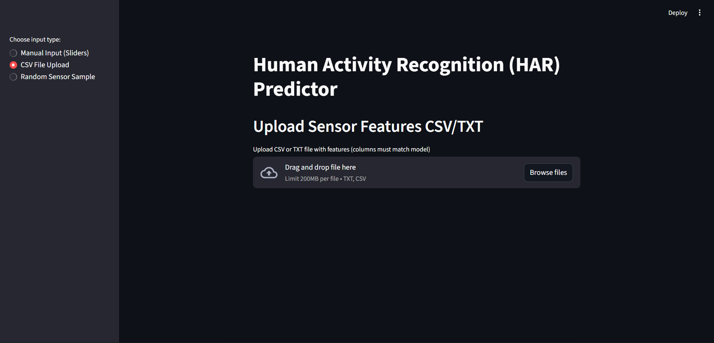

# UMBC-DATA606-Capstone App
# Human Activity Recognition (HAR) – Streamlit App

This Streamlit application provides a user-friendly interface to predict human activities based on sensor data collected from wearable devices. The goal is to demonstrate how human activity recognition (HAR) models can be deployed in an interactive setting for real-world applications such as fitness tracking, rehabilitation, and smart health monitoring.

---

## App Features

### 1. Manual Feature Input

Users can manually input sensor values using sliders for key motion-related features, including:

- Mean Body Acceleration (X, Y, Z)
- Mean Gravity Acceleration (X, Y, Z)
- Mean Body Gyroscope (X, Y, Z)
- Angle Between Acceleration Mean and Gravity

Once inputs are provided, the app will display the predicted activity (e.g., WALKING, SITTING, LAYING) in real-time.

**Manual Input Interface**


---

### 2. File Upload Prediction

Users can upload `.csv` or `.txt` files containing multiple samples of preprocessed sensor data. Each row should represent a single data sample with appropriate feature columns.

The app will return a table with predicted activities for each row.

**CSV Upload and Batch Prediction**



---

## How to Run the App

1. Install requirements:

```bash
pip install -r requirements.txt
```

 2. Launching the Streamlit application:
```bash
streamlit run app.py
```
